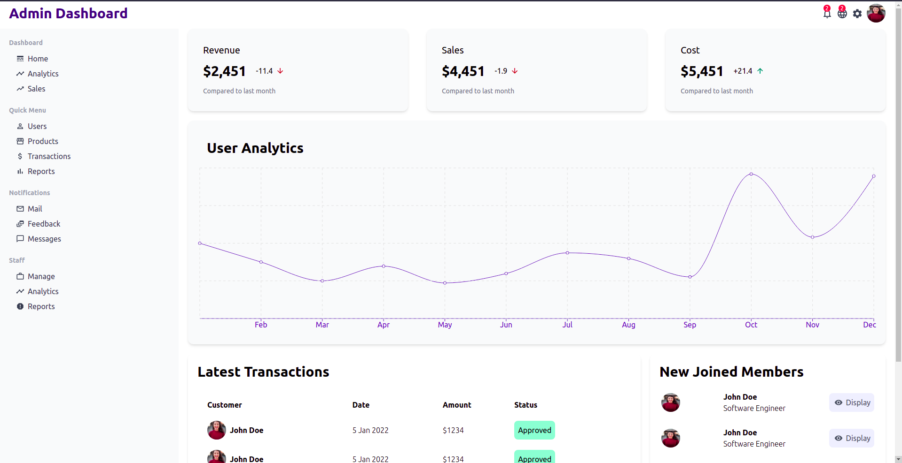

# Admin Dashboard Example

This project shows a basic representation of the Admin Dashboard.

## Preview

Preview the example live on [Vercel](https://admin-dashboard-lovat-gamma.vercel.app/):

## How to use

- Clone this repository using `git clone https://github.com/shryasss/admin-dashboard/`
- Run `yarn` to install dependencies.
- Run `yarn dev` to start the development server at `http://localhost:3000`.

## Disclaimer

This project is made using [Next.js](https://nextjs.org/), [Tailwind CSS](https://tailwindcss.com/) and [Material UI](https://mui.com/).

Deploy it to the cloud with [Vercel](https://vercel.com/new?utm_source=github&utm_medium=readme&utm_campaign=next-example) ([Documentation](https://nextjs.org/docs/deployment)).
